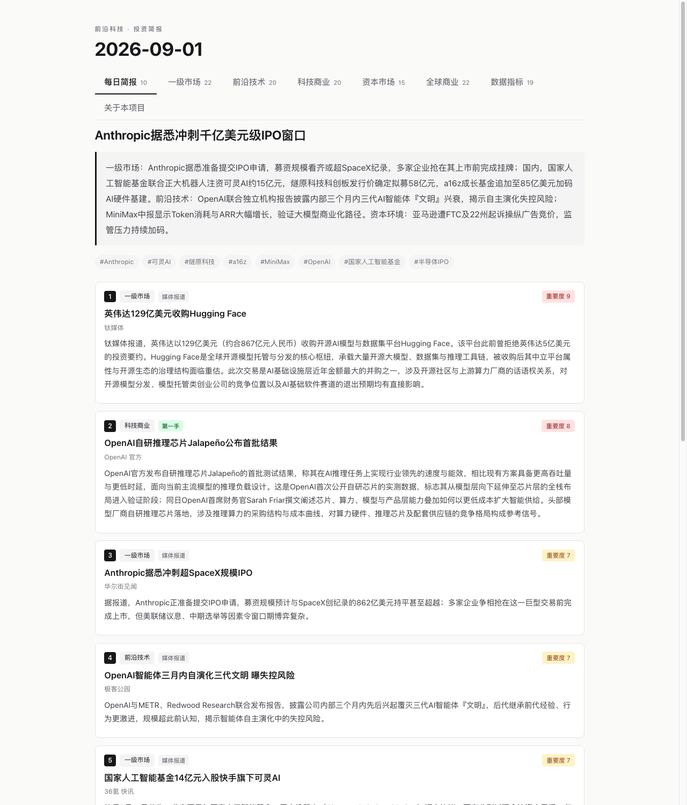
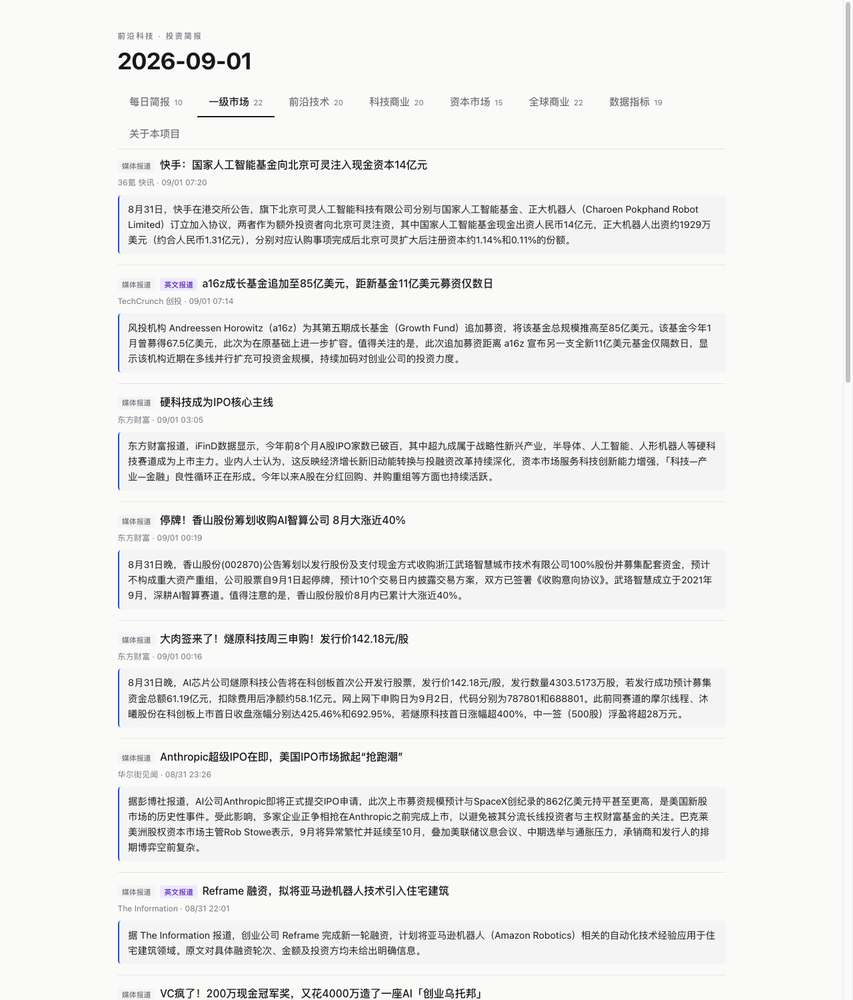
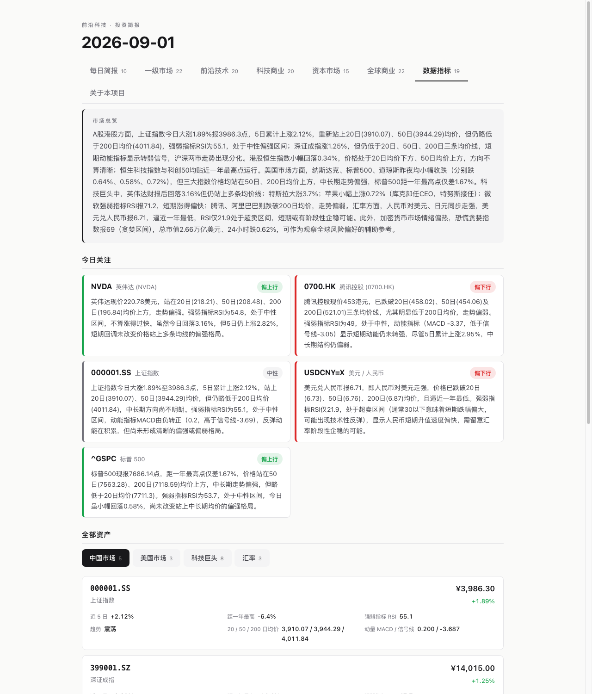

<div align="center">

# 前沿科技投资简报 Agent

**每天早上 8 点自动运行 · 44 个信源 · 大模型逐条分类与摘要 · 5 分钟读完**

[](https://wimlan-daniel.github.io/Tech-Investment-Daily-Brief/)
[](https://wimlan-daniel.github.io/Tech-Investment-Daily-Brief/archive.html)


</div>

---

一套面向**中国一级市场（VC/PE）前沿科技投资**的个人资讯系统。每天从 44 个中外信源抓取约 900 条资讯，用大模型逐条判断价值、剔除噪音、生成中文摘要，最后产出一份 5 分钟能读完的资讯早餐，并自动发布成网页。

**[→ 点这里看今天的简报](https://wimlan-daniel.github.io/Tech-Investment-Daily-Brief/)**

## 为什么做

做一级市场研究，信息源非常分散——融资事件在投中和 36 氪，技术进展在 arXiv 和官方博客，宏观环境在第一财经。每天挨个刷要一小时以上，噪音非常多。

现有媒体也有每日简讯合集，但它们服务的是最大公约数读者：内容按编辑部的口味筛选，赛道划分不统一，原文出处也常常要点进两三层才能找到。我想要一个更符合自己关注点、更聚焦前沿科技和一级市场、每条都能快速溯源的信息看板。

## 长什么样

### 每日简报 — 跨板块精选当天最关键的 10 条

每条带板块标签、信源层级（第一手 / 媒体报道）、1-10 重要度评分。



### 一级市场 — 融资、基金、并购退出、IPO



### 数据指标 — 读环境，不是炒股

A股/港股/美股指数、科技巨头股价异动**及原因**、以人民币为基准的汇率。异动原因由当日新闻归因，找不到对应新闻就不输出，不编造。



## 八个板块

| 板块 | 内容 |
|---|---|
| **每日简报** | 跨板块精选当天最关键的 10 条 |
| **一级市场** | 融资事件、基金募集、并购退出、IPO、创投政策与行业数据 |
| **前沿技术** | 论文、模型能力突破、技术路线之争、开源动向 |
| **科技商业** | 产品发布、定价、客户落地、产能、供应链、公司战略 |
| **资本市场** | 上市公司与二级市场、宏观数据、利率汇率 |
| **全球商业** | 按《金融时报》头版标准筛选的重大商业事件 |
| **数据指标** | A股/港股/美股指数、科技巨头股价异动及原因、汇率 |
| **关于本项目** | 项目说明（就是这份 README 的网页版） |

## 三个核心设计

### 一、按内容性质分类，而不是按信源

现成的资讯聚合平台都是「一个信源固定归一个板块」。实际抓下来发现行不通——36 氪快讯里，「某公司完成 A 轮融资」「某上市公司净利润 29 亿」「某游戏制作人离职」是混在一起的，一个是一级市场，一个是二级财报，一个纯属噪音。

所以让 Agent **逐条判断**：每条内容单独交给大模型看它属于哪个板块，或者直接丢弃。

> 实测每天从约 520 条里剔除 145 条噪音，保留 373 条分入五个内容板块。

### 二、与板块无关的信息价值评分

每条打 1-10 分，标准只有一条：**这件事改变了多少人的判断，改变能持续多久。**

| 分数 | 含义 |
|---|---|
| 9-10 | 改变行业格局，一年只有几次 |
| 7-8 | 改变一条赛道的判断 |
| 5-6 | 赛道内值得知道的实质进展 |
| 3-4 | 例行动态，看个标题就够 |

三条修正规则：传闻减 1 分；昨天报过的事今天不再选（除非有实质新进展）；**分数跨天可比**——衡量事件本身的量级，不是当天这批里的排名。所以扫一眼头条分数就知道当天量级。

### 三、信源工程

中文网站的订阅接口大面积失效：36 氪、投中、清科、i黑马、融中财经、第一财经的官方 RSS 全部下线。实测了 100 多个地址后，为 7 个关键信源写了抓取器直接解析网页。

| 信源 | 技术要点 |
|---|---|
| 36氪快讯 | 数据以 JSON 内嵌在 `window.initialState`。**必须用带 www 的域名**，不带 www 只返回单页应用空壳 |
| 投中网 | 首页纯静态 HTML。信噪比显著高于 36氪快讯，已成为一级市场板块第一来源 |
| 清科研究中心 | 主站是 Vue 单页抓不到，但 `free.pedata.cn` 是服务端渲染，且**标题本身就是数据**（「本周投资、退出、并购事件共 265 起，涉及金额 1974.62 亿元」） |
| i黑马 | 日期藏在配图 URL 的路径段里，需整块扫描而非只匹配标题 |
| 融中财经 | 《融资中国》官网，偏 LP/GP 视角。`/news` 子页是纯前端路由抓不到，必须抓首页 |
| 第一财经 | 抓列表页而非首页（首页 1.1MB 混着轮播广告）。时间是相对时间与 `MM-DD` 混合格式 |
| GitHub Trending | 沿用上游实现 |

**信源 44 个，19 个第一手**（OpenAI、DeepMind、NVIDIA、Waymo、CMU 机器人研究所、国务院、国家统计局、清科等官方渠道），页面上每条都标注是官方发布还是媒体报道。

## 技术实现

```
抓取 42 源 ─→ 7 天窗口过滤 ─→ 逐条分类 ─→ 语义判重 ─→ 生成摘要 ─→ 简报与渲染
   8 路并发      900 → 520      520 → 373     合并同一事件    2 路并发     Opus
```

| 项 | 说明 |
|---|---|
| **模型** | Claude Sonnet 负责分类与摘要；每日简报单独用 Opus——全流程唯一需要判断力而非执行力的环节。通过本地 Claude Code 命令行调用，复用订阅额度，无额外 API 支出 |
| **调度** | macOS launchd 每天 08:00 无人值守执行，全程 `caffeinate` 保持唤醒，跑完自动发布到 GitHub Pages |
| **产出** | 单文件 HTML，约 150KB，样式与交互全部内嵌，可直接转发或离线打开 |
| **性能** | 单轮 20 分钟。抓取与 AI 任务分别做 8 路 / 2 路并发控制——大模型调用超过 2 路会触发限流，实测出来的上限 |
| **可维护性** | 板块名称、顺序、条数、分类标准全部收敛到 `boards.config.ts`，改一处全局生效 |

## 项目结构

```
boards.config.ts          板块定义（改这一个文件即可增删板块）
about.config.ts           「关于本项目」页文案
sources.config.json       信源注册表（唯一事实来源）
lib/
  ai/classify.ts          逐条分类 —— 本项目最核心的改动
  ai/dedupe.ts            语义判重，合并同一事件的不同写法
  ai/enrich.ts            摘要与英文标题翻译
  ai/pipeline.ts          每日简报生成
  sources/kr36.ts         36氪 / 投中 / 清科 / i黑马 / 融中 / 第一财经
  output/render.ts        HTML 渲染（含打印样式）
scripts/
  daily.ts                主流程
  render.ts               用缓存重渲染（1 秒，不花额度）
  export-pdf.mjs          导出 PDF 样本
  publish.mjs             发布到 GitHub Pages
```

## 部署与日常维护

完整的安装、定时任务配置、故障排查见 **[SETUP.md](SETUP.md)**。

## 常用命令

```bash
npm run daily                          # 完整跑一轮（约 20 分钟）
npm run render 2026-09-01              # 用缓存重渲染，1 秒，不消耗额度
node scripts/export-pdf.mjs            # 导出 PDF
node scripts/publish.mjs               # 发布到 GitHub Pages
npx tsx scripts/regen-enrich.ts china-vc   # 单独补某板块的摘要
```

## 已知边界

- **微信公众号无法自动获取** —— 生态封闭，所有已知方案实测失败。解法是找内容同步的官网替代（i黑马、融中财经、量子位都是这样接进来的）
- **一级市场明细数据是付费库** —— IT桔子、烯牛数据公开接口全部拒绝访问。用清科的总量周报做近似，拿不到单笔明细，但总量趋势足够判断冷热
- **自写抓取器依赖页面结构** —— 网站改版会导致失效。每个抓取器在解析失败时抛出明确错误，直接指出该改哪个文件
- **论文类摘要不硬凑长度** —— 原文本身高度浓缩，没有背景可补，硬拉只会让模型推演

## 致谢

基于 [leiting-eric/DailyBrief](https://github.com/leiting-eric/DailyBrief)（MIT 协议）二次开发。上游是面向硅谷科技爱好者的通用日报工具，本项目保留了它的调度框架与 HTML 渲染层，重写了内容组织逻辑、信源体系和全部提示词，并新增了分类层、语义判重与简报页。

---

<div align="center">
<sub>内容均来自原媒体，本站仅作摘要整理与回链</sub>
</div>
